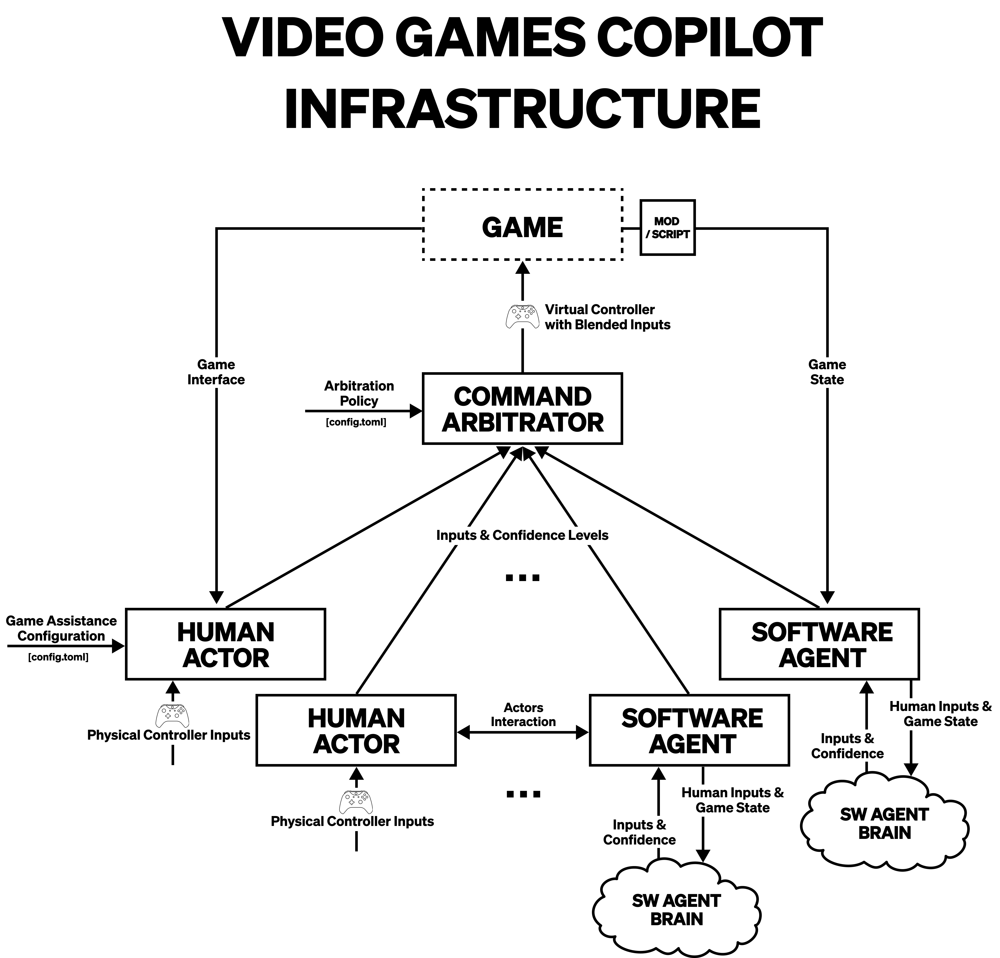

# Video Games Copilot Architecture

This repository defines a **Video Games Copilot Architecture**, a flexible framework that enables shared control over a game instance.
The architecture is built around a **Command Arbitrator**, which merges inputs from multiple **Actors** — either human
players or software agents — into a single control stream.

## Project Structure

-   **agents/** – Defines the core **Actor** classes, including **Human Actors** (physical controllers) and **Software Agent Actors** (extendable for AI-based control).

-   **command_arbitrators/** – Implements the **Command Arbitrator**, responsible for merging inputs from multiple Actors, and a **Policy Manager** that handles arbitration policies.

-   **sources/** – Manages physical and virtual input handling, including a **Physical Controller Listener**, a **Virtual Controller Provider**, and a **Game State Listener**.

-   **utils/** – Contains utility functions, such as an **argument parser**.

This architecture is designed for flexibility, allowing seamless integration of multiple human and AI-controlled inputs
to enhance accessibility and gameplay experiences.



## Requirements and Setup

To run the architecture successfully, the following tools and packages are required:

-   **Windows OS** - The architecture is currently only available for Windows.

-   A **Physical GamePad** - This can either be an XBOX Controller or a DualShock Controller (for the latter, [**DS4Windows**](https://ds4-windows.com/) is also a requirement).

-   [**HidHide**](https://ds4-windows.com/download/hidhide/) - A tool used to hide the physical controller from the game, ensuring the game receives only inputs from a Virtual Controller.

-   [**Python 3.13**](https://www.python.org/downloads/release/python-3130/) - The latest Python version as of February 2025.

-   `requirements.txt` - The required Python packages can be installed using:
    ```bash
    pip install -r requirements.txt
    ```

## Arbitrator's Configuration

The infrastructure's configuration requires 3 different configuration files:

1. `game.toml`, which contains all the information about the game for which the infrastructure is being used.
   In particular, in this file are stored the inputs that the game recognizes and to which actions they are mapped. What is written in this file should match what the game settings look like.
2. `agents.toml`, which contains all the information about the known software agents for the game. Each declared agents should explicitly report what game actions they are able to control and which parameters and commands they are able to understand.
3. `assist.toml`, which contains all the information about how the arbitration should actually happen. In particular, this file contains:
    - For every game action, which Human Actors and Software Agent Actors are allowed to execute it and to which extent.
    - For every game action, which arbitration policy should be used to merge the actor inputs.
    - Which inputs are associated with agent's meta-commands.
    - Eventually, special copilots that don't handle any action.

An example for each of these files can be found in the config folder.

## Command Line Arguments

The infrastructure requires, as command line arguments, the paths to the 3 configuration files specified in the section above.
When writing your own implementation of the infrastructure it's suggested to create an Argument Parser that extends the `ArgParser` class from the infrastructure itself.
By overriding the method `_add_arguments` you can easily introduce new command line arguments for your specific use cases.

Executing the program implementing the infrastructure will look something like this:

```bash
python main.py -gc ./config/game.toml -agc ./config/agents.toml -asc ./config/assistance.toml # your args here...
```

## Build and Installation

To build the project, you will first need to install the build package:

```bash
pip install build
```

Once the build package is installed, run the following command to generate the build artifacts:

```bash
python -m build
```

This will create two folders: `dist/` and `copilot.egg-info/`. Inside the dist/ folder, you will find a file named `copilot-<version>-py3-none-any.whl`, which can be used to install the library locally using pip:

```bash
pip install <path to the whl file>
```

Alternatively, the library can be installed directly from the GitLab repository using the following command:

```bash
pip install git+https://gitlab.di.unimi.it/ewlab/accessibility/vgcopilot/copilot.git
```

Note that in case of updates to the library, you will need to manually reinstall it by running:

```bash
pip install --upgrade --force-reinstall --no-cache-dir git+https://gitlab.di.unimi.it/ewlab/accessibility/vgcopilot/copilot.git
```
